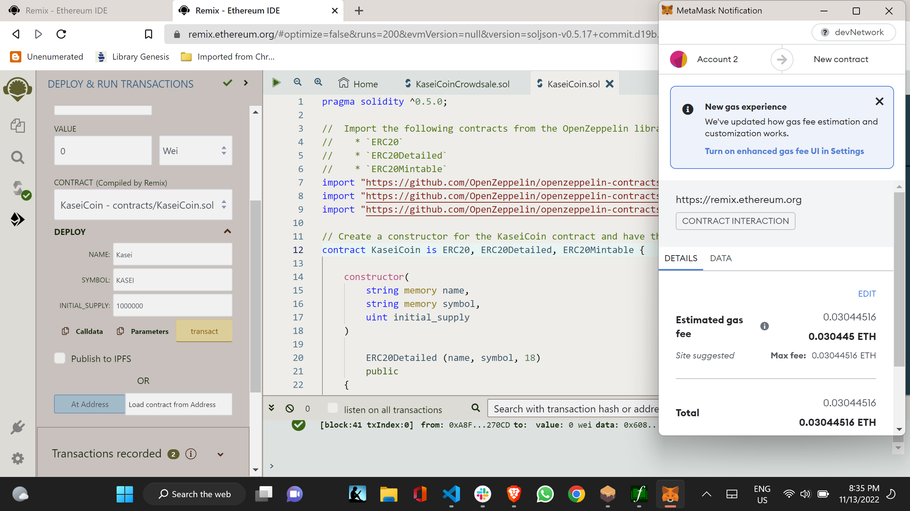
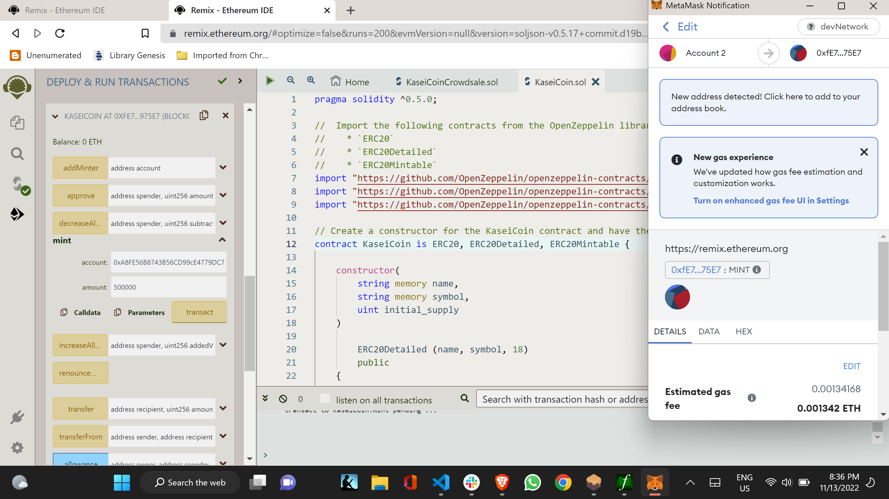
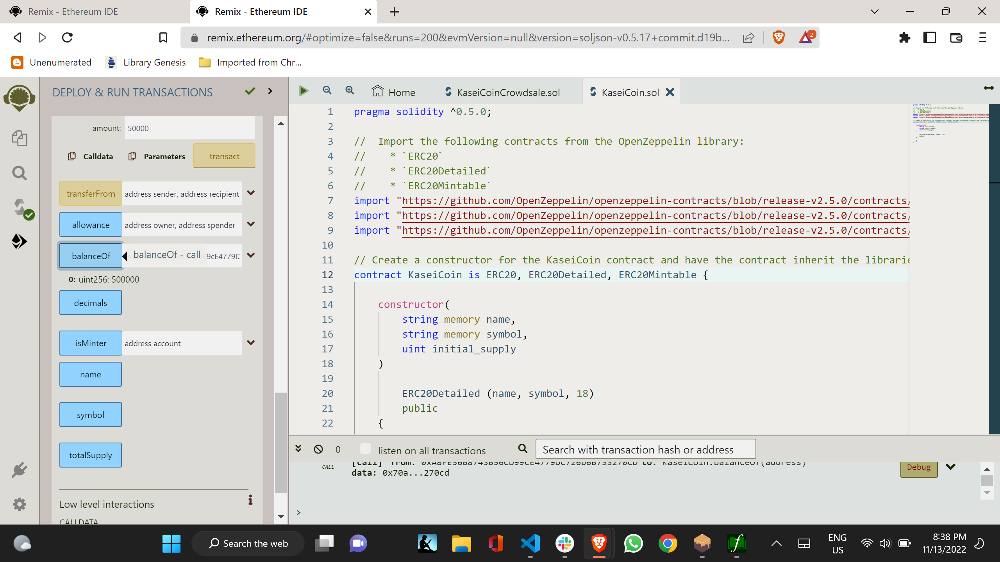
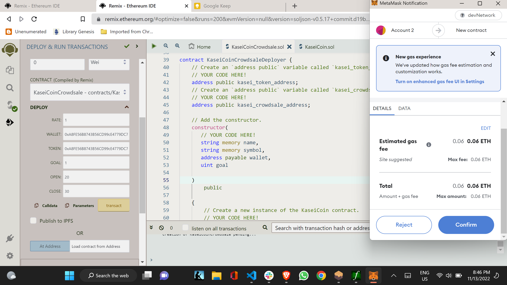

# Module_21_Challenge

Introduction

You will create a fungible token that is ERC-20 compliant and that will be minted by using a Crowdsale contract from the OpenZeppelin Solidity library.

The crowdsale contract that you create will manage the entire crowdsale process, allowing users to send ether to the contract and in return receive KAI, or KaseiCoin tokens. Your contract will mint the tokens automatically and distribute them to buyers in one transaction.

Note that the starter files that are provided for this Challenge contain a pragma for Solidity version 0.5.5. You will use the starter files to do the following:

Create the KaseiCoin token contract.

Create the KaseiCoin crowdsale contract.

Create the KaseiCoin deployer contract.

Perform a real-world, pre-production test of your crowdsale. In order to do so, you will deploy the crowdsale to a local blockchain by using Remix, MetaMask, and Ganache.

Record a short video or take several screenshots that show the deployed contract in action.

Optional: Use OpenZeppelin to extend the functionality of your crowdsale contract by adding time restrictions, refund capabilities, and a cap for the number of tokens that may be created.

The photos below provide evidence of the contract execution.

---

## Usage

The following images presents the code evidence.

##  </br>

##  </br>

##  </br>

##  </br>

## Contributors

This is the Module 21 Challenge.

My contact information is:

Name: Jeffrey M. Smith </br>
Linkedin: https://www.linkedin.com/in/jeffsmith77/ </br>
Personal email: jsmith@lexsmith.finance</br>

---

## License

MIT License

Copyright (c) 2022 Jeffrey M. Smith

Permission is hereby granted, free of charge, to any person obtaining a copy of this software and associated documentation files (the "Software"), to deal in the Software without restriction, including without limitation the rights to use, copy, modify, merge, publish, distribute, sublicense, and/or sell
copies of the Software, and to permit persons to whom the Software is furnished to do so, subject to the following conditions:

The above copyright notice and this permission notice shall be included in all copies or substantial portions of the Software.

THE SOFTWARE IS PROVIDED "AS IS", WITHOUT WARRANTY OF ANY KIND, EXPRESS OR IMPLIED, INCLUDING BUT NOT LIMITED TO THE WARRANTIES OF MERCHANTABILITY, FITNESS FOR A PARTICULAR PURPOSE AND NONINFRINGEMENT. IN NO EVENT SHALL THE AUTHORS OR COPYRIGHT HOLDERS BE LIABLE FOR ANY CLAIM, DAMAGES OR OTHER LIABILITY, WHETHER IN AN ACTION OF CONTRACT, TORT OR OTHERWISE, ARISING FROM, OUT OF OR IN CONNECTION WITH THE SOFTWARE OR THE USE OR OTHER DEALINGS IN THE
SOFTWARE.

```

```
